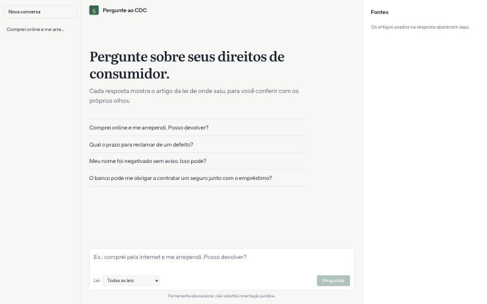
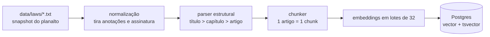
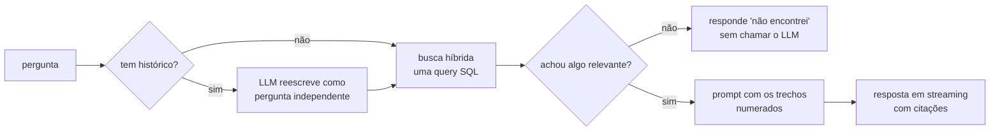

# Pergunte ao CDC

Um assistente que responde dúvidas de direito do consumidor e mostra, do lado da resposta, o artigo
da lei de onde ela saiu. Você pergunta "comprei pela internet e me arrependi, posso devolver?" e
recebe a resposta com um `[1]` clicável que abre o texto do Art. 49 do CDC.



Por baixo é um RAG (retrieval-augmented generation) feito sem framework de IA: chunking pela
estrutura da lei, busca híbrida no Postgres (pgvector + full-text) fundida com RRF, resposta em
streaming e um conjunto de avaliação que mede se a busca acha o artigo certo.

## Por que fiz isso

Eu queria um projeto de RAG em que desse para abrir cada etapa e entender o que acontece ali. A
maioria dos exemplos por aí é "chat com seus PDFs" montado em cima de LangChain, e justamente o que
me interessava (como o texto é cortado e por que a busca trouxe aquele trecho) fica escondido.

Lei é um corpus ótimo para isso. O texto é público, tem estrutura (título, capítulo, artigo,
parágrafo, inciso) e qualquer resposta pode ser conferida contra a fonte. Se o modelo inventar um
prazo, a citação entrega.

O corpus tem três normas:

| Norma | O que cobre |
|---|---|
| Lei nº 8.078/1990 (CDC) | o código inteiro |
| Decreto nº 7.962/2013 | compras pela internet |
| Decreto nº 11.034/2022 (Lei do SAC) | atendimento ao consumidor |

## Rodando em 5 minutos

Você vai precisar de Node 22 ou mais novo, Docker e uma chave da
[OpenAI](https://platform.openai.com/api-keys). Indexar as três leis custa menos de um centavo, e
cada pergunta custa frações de centavo.

```bash
git clone https://github.com/alemedinabjj/pergunte-ao-cdc.git
cd pergunte-ao-cdc
corepack enable
pnpm install
cp .env.example apps/api/.env
```

Abra `apps/api/.env`, cole a chave em `OPENAI_API_KEY=` e siga:

```bash
docker compose up -d postgres
pnpm db:migrate
pnpm ingest
pnpm dev
```

A interface fica em http://localhost:5173 e a API em http://localhost:3100. O Postgres sobe na
porta 5439 do host para não brigar com outro Postgres que você já tenha rodando.

O `pnpm ingest` imprime um resumo por lei. Rodar de novo não refaz nada que não mudou:

```
cdc: 164 chunks (0 novos, 0 alterados, 164 sem mudança, 0 removidos) em 1.0s
```

### Tudo em Docker

```bash
cp .env.example apps/api/.env   # e cole a chave
docker compose up -d --build
docker compose run --rm api node dist/cli/ingest.js
```

Aí é só abrir http://localhost:8080. O nginx serve o front e repassa `/api` para a API.

### Sem chave, 100% local (Ollama)

Dá para rodar tudo na sua máquina com [Ollama](https://ollama.com), desde que ela aguente. Na minha
(MacBook com 8 GB) o modelo de chat travou o sistema, então recomendo uns 16 GB de RAM.

```bash
ollama pull bge-m3
ollama pull qwen2.5:7b
```

No `apps/api/.env`, troque `EMBEDDING_PROVIDER=ollama` e `LLM_PROVIDER=ollama` e rode `pnpm ingest`
de novo: ele percebe que o modelo de embedding mudou e refaz os vetores. No macOS use o Ollama
nativo, porque dentro do Docker ele não acessa a GPU. No Linux existe um serviço pronto no compose
(`docker compose --profile ollama up -d`).

Também dá para gerar as respostas com Claude: `LLM_PROVIDER=anthropic` e `ANTHROPIC_API_KEY`.

## Como funciona

### Ingestão (offline, `pnpm ingest`)



1. Snapshot: o `apps/api/scripts/fetch-laws.ts` baixa o HTML do planalto.gov.br, remove o texto
   riscado (a redação revogada que o site mantém visível) e grava `.txt` versionados no repo. A
   ingestão nunca acessa a internet para buscar lei.
2. Normalização: some com "(Redação dada pela Lei nº …)", "(Incluído pela …)" e o bloco de
   assinatura do fim, e troca o `°` que o planalto usa como ordinal por `º`.
3. Parser: uma máquina de estados lê linha por linha e monta a árvore: título, capítulo, seção
   (inclusive "Capítulo VI-A"), artigo (inclusive "54-A"), parágrafos, incisos e alíneas. Artigos e
   parágrafos vetados ficam de fora.
4. Chunking: um artigo vira um chunk, porque artigo é a unidade natural de citação. Artigos
   acima de ~350 tokens (o Art. 39, com 14 incisos) são divididos em grupos de incisos e
   parágrafos, e cada parte repete o caput para continuar fazendo sentido sozinha. O texto que vira
   vetor leva junto a lei e o caminho na estrutura ("CDC — Título I > Capítulo VI > …"), enquanto a
   citação mostra só o texto limpo.
5. Gravação: cada chunk tem um hash do conteúdo. Só é embedado de novo o que mudou
   ou o que foi gerado com outro modelo de embedding; o que sumiu do texto é apagado, tudo numa
   transação por lei.

As três leis rendem **196 chunks**.

### Consulta (online, `POST /api/chat`)



Numa conversa em andamento, "e se for compra online?" não diz nada sozinho para a busca. Por isso
o LLM primeiro reescreve a pergunta usando as últimas mensagens, e é essa versão que é buscada (ela
fica salva em `standalone_query`).

A busca é uma query só, com três listas fundidas por Reciprocal Rank Fusion: os 30 vizinhos mais
próximos por cosseno, os 30 melhores no full-text em português e, quando a pergunta cita "art. 49",
o próprio artigo. Entram os 6 primeiros. Se ninguém citou artigo e a melhor similaridade ficou
abaixo de `MIN_SIMILARITY`, a API responde que não encontrou e nem chama o modelo.

Os trechos vão para o prompt numerados, em blocos `<documento id="1" lei="CDC" ref="Art. 49">`.
O modelo é instruído a responder só com base neles, citar como `[1]` e ignorar qualquer instrução
que apareça dentro dos documentos, que é a defesa contra prompt injection indireta.

A resposta chega por SSE. Primeiro os metadados, depois as fontes (o painel da direita já aparece
antes do texto), depois os tokens e, no fim, quais fontes a resposta realmente citou; as outras
ficam esmaecidas. Se você clica em "Parar" ou fecha a aba, o `AbortController` chega até a chamada
do modelo e a geração para. O que já tinha saído fica salvo como resposta interrompida.

## Estrutura do repositório

```
apps/
  api/                    NestJS
    src/modules/
      ingestion/          snapshot, normalização, parser, chunker, ingestão
      retrieval/          busca híbrida (SQL) e caso de uso de busca
      chat/               resposta com citações, SSE, histórico, prompts
      llm/                portas Embedder/LlmClient e adaptadores OpenAI, Ollama, Claude
    src/eval/             métricas e runner da avaliação
  web/                    React + Vite
packages/
  contracts/              schemas Zod usados pela API e pelo front
data/laws/                texto das leis (snapshot versionado)
eval/                     perguntas de avaliação e resultados
docs/adr/                 decisões de arquitetura
```

O pacote `contracts` é a fonte única do formato de cada request, resposta e evento SSE. A API
valida a entrada com esses schemas e o front valida tudo o que recebe; se um lado mudar o
contrato, o typecheck do outro quebra.

## Tecnologias

| Peça | O que é | Por que escolhi | O que deixei de lado |
|---|---|---|---|
| **NestJS 11** | framework Node com injeção de dependência | portas e adaptadores ficam naturais: o caso de uso recebe `Embedder` e `LlmClient`, e os testes trocam por fakes | Fastify puro: menos cerimônia, mas eu teria de montar a mesma estrutura na mão |
| **PostgreSQL 17 + pgvector 0.8** | banco relacional com tipo vetor e índice HNSW | vetor, full-text e dados da aplicação no mesmo banco, numa query só | Pinecone/Qdrant: mais uma peça para operar e sincronizar |
| **Drizzle ORM** | ORM tipado, próximo do SQL | suporta `vector` e índices HNSW no schema e deixa escrever a query híbrida com `sql` sem perder os tipos | Prisma: o SQL cru da busca ficaria fora do modelo de tipos |
| **OpenAI** | `text-embedding-3-small` (1024 dim.) e `gpt-6-luna` | barato, rápido e não depende da máquina de quem roda | Ollama como padrão: travou meu notebook (continua como opção) |
| **Zod 4** | validação de schemas com inferência de tipos | um schema por contrato, usado pelos dois lados; valida também env e respostas dos provedores | tipos duplicados à mão entre API e front |
| **React 19 + Vite** | SPA | o produto é uma tela de chat; não precisa de SSR | Next.js: renderização no servidor que a tela não usa |
| **TanStack Router e Query** | rotas tipadas e estado de servidor | parâmetros de rota tipados e cache/refetch do histórico sem escrever `useEffect` | React Router + estado global |
| **Tailwind v4** | utilitários CSS com tokens em `@theme` | a paleta inteira mora em variáveis, com tema escuro trocando só os valores | shadcn/ui: para três controles (texto, seleção e botão), os elementos nativos bastaram |
| **Vitest + Testcontainers** | testes unitários e de integração | os testes de integração sobem um Postgres com pgvector de verdade, então a query híbrida é testada no banco | mockar o banco, que esconderia justamente a parte mais arriscada |
| **MSW** | mock de rede no nível do `fetch` | o hook de streaming é testado com uma resposta SSE de verdade, chegando em pedaços | mockar o hook |
| **Biome + commitlint + husky** | lint/format e mensagens de commit | uma ferramenta rápida no lugar de ESLint + Prettier; commits no padrão Conventional Commits | |

## Decisões e trade-offs

### Por que RAG e não a lei inteira no prompt

As três normas somam algumas dezenas de
milhares de tokens. Um modelo de contexto longo com prompt caching daria conta, e para um corpus
desse tamanho seria uma alternativa honesta. Escolhi RAG porque o projeto também precisava rodar com
modelos locais de contexto curto, porque o filtro por lei e a citação por artigo saem naturalmente
da busca, e porque um corpus que cresce (jurisprudência, outras leis) quebraria a outra abordagem.

### Sem LangChain

Detalhado no [ADR 0001](docs/adr/0001-rag-sql-first.md). Cada etapa é código do
projeto, com teste.

### Full-text com OR em vez de AND

O `websearch_to_tsquery` liga os termos com AND. Uma pergunta
como "posso devolver produto comprado pela internet?" exigiria que um artigo tivesse todas essas
palavras, e a lista de palavra-chave viria vazia. A query troca `&` por `|` e deixa o `ts_rank_cd`
ordenar quem casa mais termos. O efeito colateral é que quase tudo casa com alguma coisa, por isso
a guarda de "não sei" não usa o match de palavra-chave ([ADR 0002](docs/adr/0002-busca-hibrida-rrf.md)).

### Um índice HNSW para 196 linhas

Com esse volume, o próprio Postgres prefere não usar o índice:

```
-- o planner escolhe scan sequencial (custo estimado 45)
Seq Scan on chunks ... rows=196
Execution Time: 1.773 ms

-- forçando o índice (custo estimado 939)
Index Scan using chunks_embedding_hnsw on chunks ... rows=30
Execution Time: 1.125 ms
```

O índice está lá porque é o que muda quando o corpus passa de algumas dezenas de milhares de
linhas, e porque o filtro por lei já usa `hnsw.iterative_scan = relaxed_order` (pgvector 0.8) para
não devolver menos resultados do que o pedido, uma armadilha clássica de busca vetorial filtrada.

### `tsvector` preenchido no INSERT

O caminho óbvio seria uma coluna gerada com
`to_tsvector('pt_unaccent', ...)`, mas a extensão `unaccent` não é `IMMUTABLE` e o Postgres recusa.
A configuração de busca `pt_unaccent` (português + unaccent) faz "credito" encontrar "crédito", e o
vetor de busca é calculado na gravação.

### POST + SSE escrito à mão

`EventSource` e o `@Sse()` do Nest só fazem GET, sem corpo. O
controller escreve os eventos direto na resposta, e o front lê o corpo do `fetch` com
`eventsource-parser`. O nginx do compose tem `proxy_buffering off`, senão os tokens chegam todos
juntos no final.

### Sem `temperature`

Os modelos de raciocínio atuais da OpenAI e da Anthropic recusam parâmetros
de amostragem. Os adaptadores não enviam e o tamanho da resposta é controlado pelo prompt.

### Avaliação fora do CI de cada PR

O eval chama uma API paga e o resultado só muda quando muda o
chunking, o modelo de embedding ou a query. Ele roda sob demanda (`pnpm eval` ou o workflow manual
no GitHub Actions); o CI de cada push roda lint, tipos e as suítes de teste.

## Avaliação

`eval/dataset.jsonl` tem 28 perguntas escritas do jeito que alguém pergunta, sem copiar o texto da
lei: 21 coloquiais, 3 citando o artigo e 4 fora do escopo (furto, divórcio, férias, IPVA). O
`pnpm eval` roda só a busca, sem LLM, nos três modos, e mede se o artigo esperado aparece entre os
primeiros resultados.

Resultado da última rodada registrada (`eval/results/latest.md`):

| Modo | Recall@1 | Recall@3 | Recall@6 | MRR |
|---|---|---|---|---|
| só vetor | 62,5% | 75,0% | 79,2% | 0,688 |
| só palavra-chave | 33,3% | 58,3% | 75,0% | 0,489 |
| **híbrida** | **75,0%** | **83,3%** | **91,7%** | **0,813** |

Essa rodada foi feita com embeddings `bge-m3` (Ollama), antes da troca do padrão para a OpenAI.
Como a escala de similaridade muda de um modelo para outro, o limiar de "não sei" medido com o
`bge-m3` (0,5) não vale para a OpenAI. Até a próxima rodada, o padrão é um 0,3 provisório e
conservador (prefere responder a recusar). Depois de trocar o modelo, rode `pnpm eval` e ajuste
`MIN_SIMILARITY` para o limiar recomendado no relatório.

As perguntas fora do escopo servem para calibrar o "não sei": o relatório mostra, para cada limiar,
quantas foram recusadas corretamente e quantas perguntas válidas seriam recusadas por engano.

## Testes

```bash
pnpm test        # unitários: contracts, api e web
pnpm test:int    # integração: Postgres real via Testcontainers (precisa de Docker)
pnpm typecheck
pnpm lint
```

Na API, o parser e o chunker são testados com trechos reais da lei (vetados, alíneas, "54-A"), e o
caso de uso de resposta roda inteiro com fakes, inclusive cancelamento no meio da resposta, timeout
e falha do modelo. Os testes de integração cobrem migrations, a ingestão idempotente, a query
híbrida rodando no Postgres e a API HTTP completa, com o cliente desconectando no meio do stream.
No front, o hook de streaming recebe uma resposta SSE chegando em pedaços (MSW), e há um teste do
fluxo de conversa nova que troca de URL sem duplicar a última resposta.

O GitHub Actions roda tudo isso a cada push.

## Limitações e próximos passos

O eval mostra onde a busca ainda erra. "O banco só libera o empréstimo se eu fizer um seguro
junto" deveria achar o Art. 39 (venda casada), mas a pergunta não usa nenhuma palavra do artigo,
que fala em "condicionar o fornecimento". Um reranker ou uma reescrita da pergunta antes da busca
são os próximos candidatos, e o próprio eval vai dizer se ajudam.

Também falta medir a geração: hoje só a busca é avaliada, e eu quero checar se a resposta é fiel
aos trechos com um LLM-as-judge calibrado por uma amostra revisada à mão. Depois disso, as
próximas fontes seriam as súmulas do STJ sobre consumo e a parte de contratos do Código Civil.
Não há login, então o histórico é de quem estiver usando a instância.

Isto é uma ferramenta educacional e não substitui orientação jurídica.

## Licença

[MIT](LICENSE)
